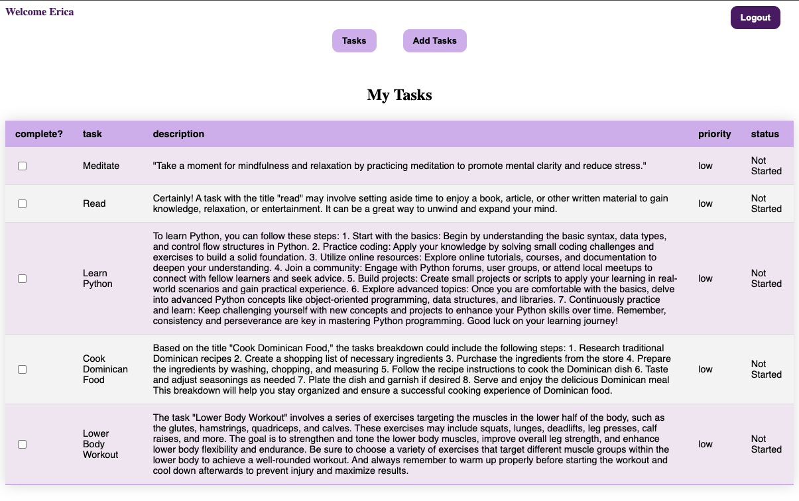
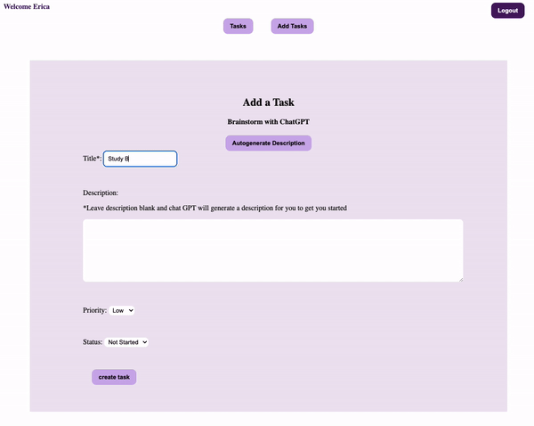
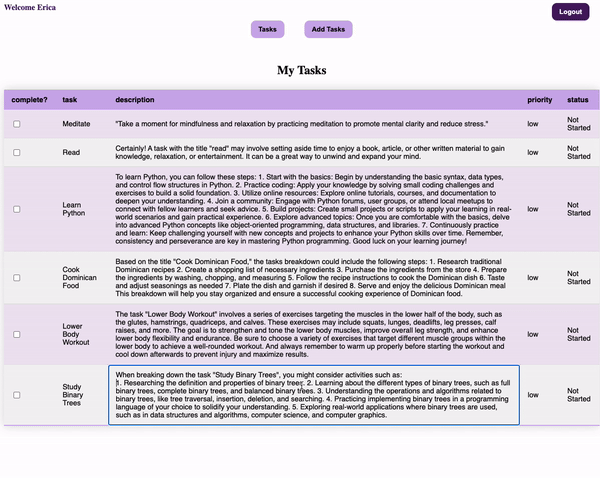
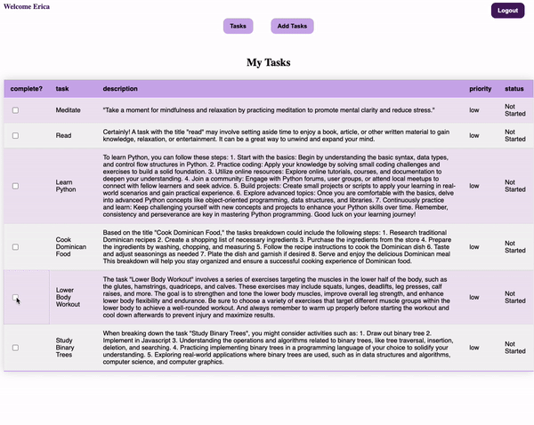

# TasksGPT

TaskGPT is a task management app that helps users brainstorm their tasks by integrating the CHatGPT API into the app for brainstorming and ideation. Leveraging the power of React, GraphQL, Node.js, and MongoDB, users are able to sign up, login, and manage their daily tasks

When adding tasks, add a title and ChatGPT can generate a description to help you brainstorm how to get the task done. User can either add title then click on "autogenerate description" button to generate chatgpt suggestion in text field, or just leave the description blank and have it generate automatically when task is added. Otherwise user can write their own description and that will be save instaed when adding task

The Description column is editable, so user can click on the text and start editing the description. Description will be automatically saved when user clicks out of text area.

Togglable completion checkboxes
